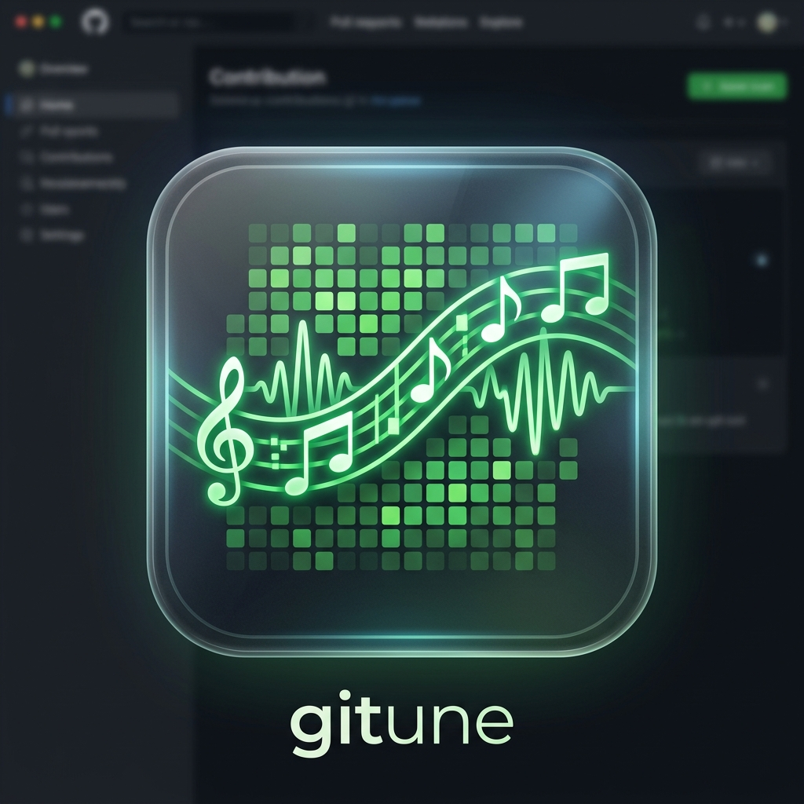

<br/>
<div align="center">
<a href="https://github.com/cdmasd/Contribution-gittune">

</a>

<h3 align="center">Gitune 🎵</h3>

  <p align="center">
    <strong>Your GitHub, as music.</strong>
    <br/>
    Convert your GitHub contribution graph into a unique musical piece, generated and played locally on your desktop.
    <br/>
    <br/>
    <a href="https://github.com/cdmasd/Contribution-gittune/issues">Report Bug</a>
    ·
    <a href="https://github.com/cdmasd/Contribution-gittune/issues">Request Feature</a>
  </p>
</div>


## 🌟 Features

- **GitHub Scraper**: Fetches any public GitHub contribution graph directly — **No API token required!**
- **Algorithmic Music Generation**: Converts a 52-week grid (364 days) into a musical scale (C pentatonic minor).
- **Pure Go Audio Engine**: Generates 44100Hz 16-bit WAV audio entirely in-memory using the Go standard library (no external audio/CGO dependencies).
- **Aesthetic UI**: Modern, dark-themed UI built with React, TailwindCSS v3, and the Web Audio API.
- **Waveform Visualizer**: Live, animated canvas-based waveform visualization reacting to the generated music.
- **Export to WAV**: Download your unique GitHub symphony instantly as a pristine `.wav` file.

## 🛠 Built With

- **[Go](https://go.dev/)** - Core backend and audio generation engine.
- **[Wails v2](https://wails.io/)** - Desktop application framework bridging Go and React.
- **[React](https://reactjs.org/)** - Frontend UI.
- **[Tailwind CSS v3](https://tailwindcss.com/)** - Utility-first styling.
- **[Goquery](https://github.com/PuerkitoBio/goquery)** - Powerful HTML scraping in Go.

## 🚀 Getting Started

### Prerequisites

Ensure you have the following installed on your system:
- [Go 1.21+](https://go.dev/dl/)
- [Node.js 18+](https://nodejs.org/)
- [Wails CLI](https://wails.io/docs/gettingstarted/installation)

### Installation

1. **Clone the repository**
   ```sh
   git clone https://github.com/cdmasd/Contribution-gittune.git
   cd Contribution-gittune
   ```

2. **Run in Development Mode**
   ```sh
   wails dev
   ```
   This will start the application with hot-reloading for both the frontend and backend.

3. **Build for Production**
   ```sh
   wails build
   ```
   The compiled binary will be placed inside the `build/bin/` directory.

## 🎵 How It Works

**1. Data Mapping:**
- `0 contributions` → Rest (Silence)
- `1-3 contributions` → Low Volume / Long Duration
- `4-9 contributions` → Medium Volume / Medium Duration
- `10+ contributions` → High Volume / Short Duration (Staccato)

**2. Harmonic Scale:**
Each day of the week corresponds to a note in the **C pentatonic minor** scale:
`Sunday: C3` | `Monday: Eb3` | `Tuesday: F3` | `Wednesday: G3` | `Thursday: Bb3` | `Friday: C4` | `Saturday: Eb4`

Each week acts as a musical chord played at ~120bpm, moving through your year of open-source contributions!

## 🤝 Contributing

Contributions are what make the open-source community such an amazing place to learn, inspire, and create. Any contributions you make are **greatly appreciated**.

1. Fork the Project
2. Create your Feature Branch (`git checkout -b feature/AmazingFeature`)
3. Commit your Changes (`git commit -m 'Add some AmazingFeature'`)
4. Push to the Branch (`git push origin feature/AmazingFeature`)
5. Open a Pull Request

## 📄 License

Distributed under the MIT License. See `LICENSE` for more information.

<hr/>
<p align="center">Made with ❤️ by cdmasd</p>
